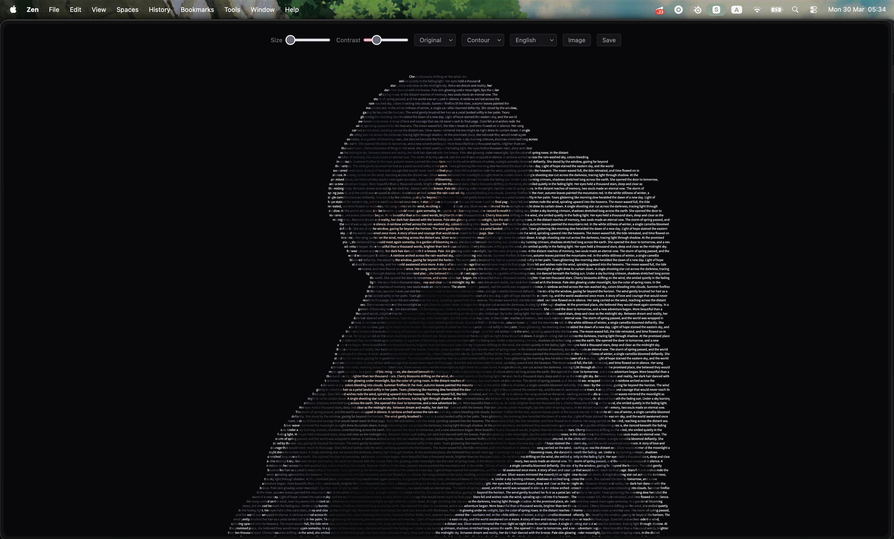

# pretext-waifu

Typographic waifu portraits powered by [@chenglou/pretext](https://github.com/chenglou/pretext).

Drop an image and watch it render as flowing Japanese/English text. Each character's color is sampled from the original image, and in contour mode, text flows within the silhouette using pretext's variable-width line breaking — re-laid-out every frame at 60fps.



## Run

```bash
npm install
npm run dev
```

## How it works

1. Detect the image silhouette (per-line left/right bounds)
2. `prepareWithSegments()` — one-time text measurement (cached between frames)
3. `layoutNextLine()` — lay out each line at a different width matching the contour
4. Render each character on canvas, colored by the pixel beneath it

Step 3 is what makes pretext essential: each line gets a different `maxWidth` (the contour width at that row), and pretext handles word-breaking correctly for each width. This runs every frame for breathing, morphing, and interactive effects.

## Features

- **Contour mode** — text flows within the image silhouette via per-line variable-width layout
- **Original colors** — characters sample RGB directly from the source image
- **Themed palettes** — Sakura, Ocean, Ember, Mono
- **Breathing** — contours pulse, triggering full re-layout every frame
- **Mode morph** — animated interpolation between Contour and Fill modes
- **Typing reveal** — characters materialize progressively on load
- **Parallax** — mouse-driven depth from brightness layers
- **Slash** — fast swipe splits text apart along the gesture path
- **Custom text** — Japanese, English, or your own

## Controls

| Control | What it does |
|---------|-------------|
| Size | Font size (6–28px) |
| Contrast | Brightness curve |
| Theme | Original / Sakura / Ocean / Ember / Mono |
| Mode | Contour (silhouette) / Fill (full canvas) |
| Text | Japanese / English / Custom |
| Image | Change image (also: drag, paste, drop) |
| Save | Export as PNG |
